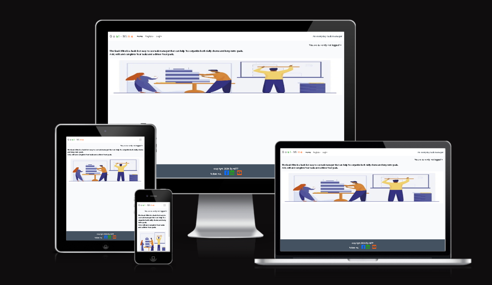
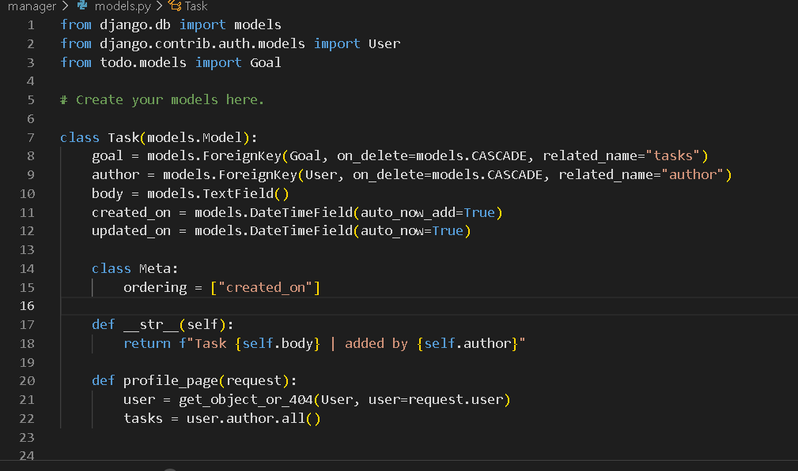

# Goal-Mine (An everyday task manager)

- The Github project can be found [here](https://github.com/Dym077/goal-mine) 
- The live link is found via [this link](https://goal-mine-8c569f15a81b.herokuapp.com/)

## Why a To-do-list app?

### The Idea behind it all
- My initial idea of building a web based task manager, was that I don't always consider myself good at planning things. 
Making the right priorities and meeting a deadline can sometimes be a challenge for many people, myself included. Therefore I thought it would be great to design something that could be a tool for achieving both bigger goals and smaller tasks. 
Making the app a web-based tool that can be operated both from a desktop computer, a tablet and a mobile phone, being fully responsive and accessible, could make life easier for a lot of people. 

## Site Owner Goals
- As a site owner I want to provide an easy-to-use but yet powerful tool for the user to manage their goals and tasks in an efficient way.
- As a site owner I want to provide the user with the opportunity to create a unique user profile which is only accessible to the user.
- As a site owner I want to make sure that the user easily can edit, delete and add new goals and tasks using the app.

## Features

### Authentication
* A new user will be prompted to create a user name and a password. As soon as that is done, the user will be able to log on to the site and start using the features. A returning user will already have created a user name and can log in with those credentials. The user will also be able to change the password if necessary. 
- For this project I was using allauth to make it possible for the user to sign up and log in to the site safely.
The user can also feel safe that noone else has access to the contet that is added or edited. The only person except the user that can access the content is the administrator, which can be contacted if the user should lose some important content.
If the user needs to update personal info or wishes to delete the account, the administrator can also be contacted.

### Goals
- A user will be able to set a new goal with a date attached to it, from the goals dashcard.
There is also an option to set a status for the goal - if it has been completed or not. Each goal has a texte area where the user can describe in detail what he goal consists of. The user can use a maximum of 200 characters to give the goal an elaborate description. Also, there is an option of assigning different tasks to every goal. These tasks can help the user to break down each goal into smaller pieces which will make it much easier to achieve the assigned goal. 

## Features left to implement.

### Tasks
- A task is a smaller chore which can be a part of a bigger goal. The task is optional and a user can attach one or more tasks to a goal. There is also the option of setting a status to each task. The user can also - as with the goals edit, update ad delete the tasks. If a task is completed it acn be given the status of done, or if it is no longer current it can be deleted. There is no limit to how many tasks a goal can have, but the user should make sure of not cluttering the goal too much. Due to time constraints, the task page wasn't properly implemented. Instead the user will be redirected to the goals form, where tasks can be added and edited manually to the users content. The decision to not include the task page was a hard one - a sort of "kill your darlings"- decision, as it was a good and quite useful feature. In a future update, the task will most likely be implemented though.

### Calendar
- Another feature that had to be put on hold because of time constraints. The calendar was planned to be on a separate page where the user could see the goals and tasks to be able to set deadlines and reschedule. This feature is not a must-have, but would absolutely be a nice addition to a future version of this project. 

## Navigation
- When a user arrives to the site, this is the first thing that will be visible:
- 
- If a user wants to add goals, the first thing to do, is to create a user account:
- 
- If You are a returning or frequent user visiting the page, it is more likely You will sign in to Your existing account instead:
- 
- When a user is done visiting the page, it is a good idea to sign out from the page:
- 
- If You are not done planning, You can click on a selected goal and go to the goal page. 
Here it is possible both to edit and delete a goal. 
- 
- If You want to delete a goal, You simply click on delete and the Delete Modal will pop up, asking You to confirm the deletion:
- 
- If You want to add a completely new goal You start from an empty form:
- 
- If You choose to edit an existing goal, You will be redirected to the goal form again.
- 
- When the goal is edited You can choose "Submit" and the goal will be added to the Goalslist:
- 

## Responiveness
- The app is responsive on all platforms, from desktop to tablets and mobile phones. 

## Planning and development
- This was the first project in which I made use of the Agile methodology. A fair amount of time went into planning the project before I could get into building it. 
I started out with a kanban board - assigned to this repository on Github, to identify the EPIS's and User Stories needed to realize the project in a satisfactory way. Using the backlog in the kanban board, appeared to be a very powerful process to keep track of what I was doing.
- Realizing the ideas I had written down and put in ERD's and flowcharts was more challenging than I expected. Actually, just coming up with a comprehensive entity relationship diagram that could be translated into code, was something I had to practice a lot before ending up with the ERD represented in this document. 
- Translating the ideas into code was another challenge. My first examples of the initial model for the project was based on a tutorial, which gave me alot of tips on how to structure the application. However I needed to go back to the drawing board as the building of this first project got too convoluted and error prone. I decided to revisit the walkthrough of Code Institutes blog project to be able to start afresh. A also went back to study the Agile methodology again, before starting writing new code.
- This final version of this project is built using the Django Framework. All models and relations betweeen them as well as dialog with databases are utilizing the powerful features built into the Django framework.  
- When struturing the views, I was not really sure which page should end up being the landing page. Therefore I changed the original index.html to goal.html. However, this really should be the index.html, as this is the page the user will be taken to after logging in or signing up. 
- As he project developed into something more solid and I had done a successful deployment of a stable app, I decided to fork the project from the main branch in git. Doing so, I could more safely try new ideas without the risk of breaking the project. When I felt confident enough, I merged the new features with the main branch. 
- It was right around this time, I couldn't figure out how to successfully wire the goals page together with the task page. After careful consideration, with time being the main culprit, I took the decision not to include the task model in this incarnation of the project. I also totally had to scratch the idea of a calendar from the drawing board. So what was left?
- After reaching out for help among my fellow students, alumnis and mentors I ended up with this super basic, but still functional application. While it's very obvious that the project would need a great deal of love and care, it's probably a good start of something more useful. 

### Target audience
- Anyone who needs a tool to structure and prioritize their goals can make use of this app.
Because of its wed-based nature, the app is available everywhere where the user has an internet connection. 

### App Objectives
- To let the user create a user profile.
- To let the user easily create, read, edit and delete the assigned goals.
- To make use of safe information storage in the Django database, and assure that the content created belongs to the user only.

## Wireframes
- Before I started writing any actual code, I invested a lot of time planning the project. My first ideas were written down and drawn on paper. Examples of the first wireframes are displayed below.
- 
- 
- 
- 
- The inspiration were found looking at other peoples projects. My intention was to make something similar but with a personal twist. As the development of the project proceeded, the wireframes also developed into something else. 

## Flow charts and ERD’s
- A similar process was used when developing the flowcharts and Entity Relationship Diagrams.
The first one was very simple and it took alot of practice before I even understood what they were for. 
- 
- 
- 
- 
- 
## Kanban board

### EPICS
* Create App
* Django Setup
* Pagination
* Account Management
* Goals
* Tasks
* Calendar
* Deployment
* Documentation 
* Testing 

### User Stories
- The user stories in the kanban board are structured from a template, making use of the Agile methodology. 
They have one or more Acceptance Criterias attached to them, and are also labelled in importance from "must have" to "won't have". A user story that has a "must have" label attached to it, will probably be one of the most important features, let's say the Goal feature. A user story such as "Login with social media platforms", would probably have a label of "could have".
Below are all the user stories I created for this project - far from all of them were implemented, but the most important "must haves" are implemented in their basic form. There are a few "should haves", such as the Delete Account function, which has not been implemented yet. 

* Automated Testing
* Goals Menu
* Update Personal Info
* Readme
* Show Goals/ tasks
* Goals dash card
* Delete Goal
* Delete Account
* Log in with social media platforms
* Links to social media
* Scheduled taskt - status
* Manual testing
* Responsiveness and accessibility
* Log in/ Log out
* ERD
* Tasks menu
* Sign up
* Task dash card
* Reset password

### Models
- This app makes use of two models, basically; the Goal and the Task. 
In this version, only the Goal version was made functional because of developing difficulties, leading to time shortage.
However, the base code for the Task model is written and will be implemented into a future version of the project. 
- 
- 

## Design
- The goals that the user adds into the application, will be displayed in a listview, which is not optimal but works well for this project. 
### Colors
- I tried to use colors that blend well together and don't conflict too much. Both for a better user experience and accessibility. When setting the color scheme, I was aware of the colors in the image on the landing page and chose the colors accordingly.
- .png)
- This green color has a HEX value of #188123 and was used for the masthead background in the goal area as well as for the submit and edit buttons. Both dark and light text is clearly visible on it and the hue has a soothing feel to it.
- .png)
- This color value is similar to the one above, but has a HEX value of #22a11f and it was used on som lettering on the base.html.
- 
- The red color is often used to signal a warning or something that needs som extra attention, but it can also be decorative and serve multiple purposes to ease accessibility in a web app. It has been used for some lettering as well as on the delete button in the goal area. While it's quite obvious that this hue is more reminiscent of orange than anything else, I choose to call it red for this project.
- 
A great background color for most purposes in a web app. The developer should pay some attention to the choice of letters to work in conjunction with the background though. 

- .png)
- A slightly more greenish tone that blends in quite well with the more clear green and pure grey colors. 
### Fonts
- For this project I did not have to look for a specific font to get it to work - I used the default google font from the walkthrough, as it fitted this type of app perfectly. 
"https://fonts.googleapis.com/css2?family=Indie+Flower&family=Jersey+25&family=Noto+Serif:ital,wght@0,100..900;1,100..900&family=Platypi:ital,wght@0,300..800;1,300..800&family=Share+Tech+Mono&family=Ubuntu+Mono:ital,wght@0,400;0,700;1,400;1,700&display=swap

### CRUD Implementation
- This app makes use of the CRUD operations (Create, Read, Update & Delete).
For example, when a user is adding a new goal, the app is creating this item.
The user is then able to view this item, which is making use of the "read"-operation
If a user has to update a goal, the selected item can be edited in the form and submitted again,
which makes use of the "update"-operation. Finally, if a user wants to delete a goal, clicking the Delete- button 
will make use of the "delete"-operation and the item will be erased accordingly. 

## Testing

### Automated testing
- This project was the first one where I used automated testing. This was also one of the last things I got familiarized with during the building of the application. Therefore I'm not sure I fully grasped the power of it. However, there's a high probability that I will employ this unctionnnnfor testing future projects, as well as updated  versions of this app. 

### PEP8 Testing
- All python code has been tested with the ![Pythonchecker]https://www.pythonchecker.com/
Results vary from 'solid'(c:a 50%) to 'guido'(100%).
### Input Testing
- The register and login/logout fields accepts and handles text and integer input properly.
- The body field of the goal page accepts text and integer input up to 200 characters and the input is properly processed after the submit button is clicked. 
- The delete modal also handles onclick input to process requests such as edit and delete. 

### Other Testing
• Lighthouse
- Lighthouse testing of the page resulted in an average score of 94% for desktop and 92% for mobile devices.

•	JSHInt 
- The JavaScript validation returned no errors but these warnings were listed:
19 warnings
1	'const' is available in ES6 (use 'esversion: 6') or Mozilla JS extensions (use moz).
2	'const' is available in ES6 (use 'esversion: 6') or Mozilla JS extensions (use moz).
3	'const' is available in ES6 (use 'esversion: 6') or Mozilla JS extensions (use moz).
4	'const' is available in ES6 (use 'esversion: 6') or Mozilla JS extensions (use moz).
6	'const' is available in ES6 (use 'esversion: 6') or Mozilla JS extensions (use moz).
7	'const' is available in ES6 (use 'esversion: 6') or Mozilla JS extensions (use moz).
8	'const' is available in ES6 (use 'esversion: 6') or Mozilla JS extensions (use moz).
11	'let' is available in ES6 (use 'esversion: 6') or Mozilla JS extensions (use moz).
11	'for of' is available in ES6 (use 'esversion: 6') or Mozilla JS extensions (use moz).
12	'arrow function syntax (=>)' is only available in ES6 (use 'esversion: 6').
13	'let' is available in ES6 (use 'esversion: 6') or Mozilla JS extensions (use moz).
14	'let' is available in ES6 (use 'esversion: 6') or Mozilla JS extensions (use moz).
14	'template literal syntax' is only available in ES6 (use 'esversion: 6').
17	'template literal syntax' is only available in ES6 (use 'esversion: 6').
22	'let' is available in ES6 (use 'esversion: 6') or Mozilla JS extensions (use moz).
22	'for of' is available in ES6 (use 'esversion: 6') or Mozilla JS extensions (use moz).
23	'arrow function syntax (=>)' is only available in ES6 (use 'esversion: 6').
24	'let' is available in ES6 (use 'esversion: 6') or Mozilla JS extensions (use moz).
25	'template literal syntax' is only available in ES6 (use 'esversion: 6').
One undefined variable
6	bootstrap

•	W3C CSS Validator
- The CSS passed through the validation tool without any errors or warnings.
•	W3C HTML Validator
- The validator returns some useful info and errors that don't create any conflicts in the project. However they are listed below just for the sake of the documentation. In a future version of this project, there might be useful information to draw from when implementing new features. 
- [HTML Validation](documentation/html_errors.png)
- [HTML Validation2](documentation/html_errors2.png) 
### Browser testing
- The app has been tested for its responsiveness on desktop, laptop, tablet and mobile phone.
It is fully responsive on all devices. 
- Amiresponsive and Responinator were also useful tools when testing the apps responsiveness.

## Technologies Used
•	Framework
-	Django
•	Languages
-	Python
-	HTML
-	CSS
-	JavaScript
•	Databases
-   PostgreSQL
### Libraries used
- Django
- Bootstrap 5
- Summernote 
- Whitenoise
- Middleware
- Allauth

## Data model

### Programs Used
* Gitpod for coding.
* Lucidchart for making ERD's.
* Visual Studio Code for additional coding

## Agile Methodology
* Making use of the Agile Methodology for the first time was a steep learning curve for me. However, it proved to be a quite powerful awy of realizing a project. Even though I struggled to put the final project together, it would probably have been even more difficult without proper planning and methodical structuring of the application.  
* Kanban board: https://github.com/users/Dym077/projects/2 

## Known Bugs
- No bugs are currently known

## Fixed Bugs
- When trying to submit a goal when not logged in, the user would encounter an error instead of being prompted to log in first. This error as the cause of the login function not restraining access to the goal form, which should only be accessible after the usrer has been registered or logged in. To prevent this from happening, I made the goal form inaccessible to an unauthenticated user, which acquires a new user to register or a returning user to simply login. 

## Deployment
* This project was deployed using Heroku.
I made an early deployment to ensure that the live app was running correctly and that the versions of the libraries were working together.
- This is how to create the Heroku app:
- Log in to Heroku or create a new account.
- When on the main page, click the button called New in the top right corner and from the drop-down menu select "Create New App".
- Type in the name of the app, which must be unique to work.
- Select your region.
- Click the Create App button.
- Click the Settings Tab - scroll down to Config Vars.
- Click Reveal Config Vars and enter PORT into the Key box and 8000 into the Value box and click the Add button.

## Credits
- [Planner App (Task Manager)](https://github.com/OleksiyLa/Project_4)
- Image was downloaded from [Freepik](https://www.freepik.com/)  Designed by pch.vector / Freepik
### Resources Used

#### Online Resources
- [Django To Do List App With User Registration & Login](https://www.youtube.com/watch?v=llbtoQTt4qw&t=1484s)
- [TinyPNG](https://tinypng.com/) for compressing images.
- [Cloudconvert](https://cloudconvert.com/) for comverting images to webp-format.
- [TTSReader](https://ttsreader.com/player/) for transforming chunks of text in the learning modules to speech.
- [AmIResponsive](https://ui.dev/amiresponsive) for testing the app on multiple virtual devices.
- [Responsinator](http://www.responsinator.com/) also for testing the app on multiple virtual devices.
- [Dee Mc](https://www.youtube.com/@IonaFrisbee) for further learning of the Django framework.

#### Desktop resources
* Affinity Photo for image editing.
* Paint for image editing.

## Acknowledgments
- Antonio Rodriquez
- Tomas Kubancik
- Eventyret
- Roman Rakic & the tutors at Code Institute
- Martin Degerman
- The Slack community and Community Sweden

